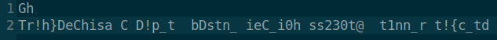
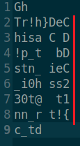
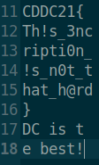

# Translantic (300 Pts)

# Challenge Description

One of our agents intercepted an encrypted message. All we know about it is that it is encrypted using a well-known cypher. Help us decrypt it.

# Writeup

This is the encrypted text that we see when we open the file



Looking at the encrypted text, it seems like the characters of the flag are randomly scrambled up. However the title of the challenge _Trans_-lantic gives us a small hint that this text is likely a transposition cipher.

After some trial and error, if we put every 8 character in a new line, we begin to see the forming of the flag. Each column forms part of the text



Therefore we get the following for each column



And thus we can form the flag :

```
CDDC21{Th!s_3ncripti0n_!s_n0t_that_h@rd}
```
