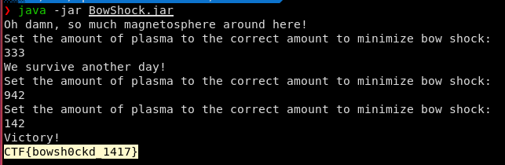

# BowShock

## Challenge type

reverse engineering - 50pts

## Challenge Description

Bow shock is an amazing phenomenon, but you better not get too close…

Can you find out how to minimize bow shock and prevent everything from turning into dust?

## Write up

We are given a jar file for this challenge, using and online decompiler we can decompile the jar file into java code

``` java
import java.util.InputMismatchException;
import java.util.Scanner;

class BowShock {
   public static int totalInput;

   public static int getInput() {
      System.out.println("Set the amount of plasma to the correct amount to minimize bow shock: ");
      Scanner var0 = new Scanner(System.in);

      int var1;
      while(true) {
         try {
            var1 = var0.nextInt();
            break;
         } catch (InputMismatchException var3) {
            System.out.print("Invalid input. Please reenter: ");
            var0.nextLine();
         }
      }

      totalInput += var1;
      return var1;
   }

   public static void bowShock() {
      System.out.println("And all was dust in the wind.");
      System.exit(-99);
   }

   public static void main(String[] var0) {
      System.out.println("Oh damn, so much magnetosphere around here!");
      if (getInput() != 333) {
         bowShock();
      }

      System.out.println("We survive another day!");
      if (getInput() != 942) {
         bowShock();
      }
```

We can observe that `getInput()` takes in an int from stdin and adds it totalInput.looking into the main function we can see the sequence of inputs that we need to enter to reach the flag. doing some simple additions we can deduce the flag is 

```
CTF{bowsh0ckd_1417}
```

And we can double check by running the jar file and entering the sequence of numbers to get the flag.



## flags

1. `CTF{bowsh0ckd_1417}` - 50pts
