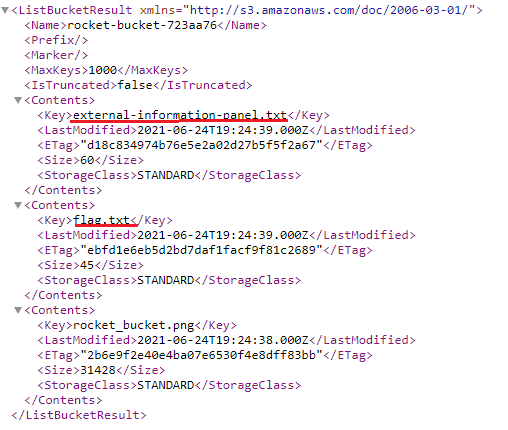

# Locked out

## Challenge type 

Cloud - 125 pts

This challenge is a 4-part challenge with each flag worth 25 pts.

## Challenge Description

The spaceship that you will use in SPACE RACE is almost ready. One of the last steps is to verify that all of the systems are operational. Unfortunately, the AI controlling the system information decided to take a personal time off for a few days, leaving you without an easy access to the spaceship systems. This is not a problem because, as the cyber security specialist in the ship, you know the spaceship cloud infrastructure like the back of your hand.

Flag 1 - Your spaceship is located [here](http://planet-bucket-43b2a07.s3-website-eu-west-1.amazonaws.com/), can you find the external information panel?

Flag 2 - You have gained access to the external infromation endpoint. Can you access the spaceship logs to obtain the access keys?

Flag 3 - You have managed to access the spaceship. You see a cleaning bucket, the Lambda Thrusters information panel tag and the E-space Computing Cloud system tags. What does the tag in the cleaning bucket says?

Flag 4 - What is the tag in the Lambda Thrusters information panel?

Flag 5 - What is the tag in the E-space Cloud Computing System?

## write up

From the challenge description we are given the following link.

```http://planet-bucket-43b2a07.s3-website-eu-west-1.amazonaws.com/```

From the link it is obvious that we are dealing with another challenge involving Amazon Web services.

Clicking on the link would lead us to the following landing page.


Doesn't seem like much, lets explore the source code of the page.


aha! it seems like we have found another S3 bucket of interest to us. accessing the bucket we get to the XML file stored in the bucket and we see several things of interest.



Downloading the flag.txt file and we have obtained our first flag - `CTF{0841862f273fd2ca20ea3b94a645781071ab19d7}`

Downloading the `external-information-panel.txt` we can find the following link

```https://g0341x75tb.execute-api.eu-west-1.amazonaws.com/logs```

However it seems like accessing this link is not going to be easy as we get a 405 error stating GET method is not allowed. Doing some trial and error we are able to obtain the logs file by using `curl` with the PUT option : `curl -X PUT https://g0341x75tb.execute-api.eu-west-1.amazonaws.com/logs`

Redirecting the output into a text file and opening it we can find our second flag - `CTF{9177a9c8bb1cd5c85934}`

Scrolling through the logs we find another area of interest, Access key ID and Secret access key!


Log in to the account associated with the keys using the command `aws configure`.

For the 3rd flag, the challenge description seems to give us a hint that we should be looking into an S3 bucket 'What does the tag in the cleaning _bucket_ says?'

Doing the following command `aws s3 ls` would indeed reveal another S3 bucket.


To find the tag we simply issue the following command `aws s3api get-bucket-tagging --bucket cleaningbucket-cf2be35`

And we can obtain the 3rd flag - `CTF_855cc724fd34896c8875`

For the 3rd flag, we are given a hint to look into the Lambda service

Fort the 4th flag, we are given a hint to look into the EC2 service 

## Flags

1. `CTF{0841862f273fd2ca20ea3b94a645781071ab19d7}` - 25 pts

2. `CTF{9177a9c8bb1cd5c85934}` - 25pts
 
3. `CTF_855cc724fd34896c8875` - 25 pts

4.

5.
