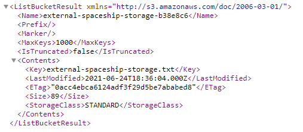
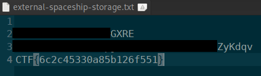
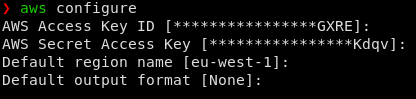
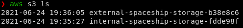
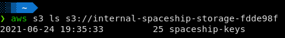

# Locked out

## Challenge type 

Cloud - 50 pts

This challange is a 2-part challenge with each flag worth 25 pts. 

## Challenge Description

After a relaxing space walk, you realize that you have been locked out of your spaceship by the spaceship's AI. Thankfully, you remember that you prepared for this eventuality by storing access keys in an external storage.

flag 1 - Open the [external storage](https://external-spaceship-storage-b38e8c6.s3-eu-west-1.amazonaws.com/) and see if there is something useful in there.

flag 2 - You have managed to get keys. See if you can get inside and check the internal spaceship storage.

## write up

From the challenge description we are given a link to the ships external storage.

``` https://external-spaceship-storage-b38e8c6.s3-eu-west-1.amazonaws.com/ ```

From the URL it is obious that the challenge is leveraging on Amazon Web Services and we can have a sensing that we would need to use the `aws` CLI tool.

clicking on the link would lead us to the XML file stored in the S3 database .



We can see that there is a text file stored in this particular bucket, downloading and opening the text file would reveal :

1. The first flag - `CTF{6c2c45330a85b126f551}`
2. The AWS access key ID and the secret access key



To find the second flag we would have to log in into the account associated with the keys found in the first part of the challenge using the command `aws configure` in the aws cli.



Once we have logged in, we can use the  following command `aws s3 ls` to list all the buckets associated with this account.



we can see that the external spaceship storage bucket is present, but our interest lies on the internal spaceship storage bucket. accessing the bucket we can see that it contains the following.



Download the file by using the `cp` command and opening it would reveal the second flag - `CTF{4ababede5580d9a22a2a}`

## Flags

1. `CTF{6c2c45330a85b126f551}` - 25pts

2. `CTF{4ababede5580d9a22a2a}` - 25pts
