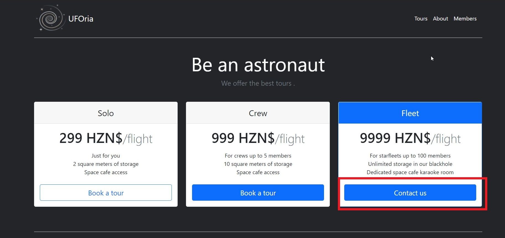

# Locked out

## Challenge type 

Web OSint - 150 pts

This challenge is a 2-part challenge with each flag worth 75 pts.

## Challenge Description

UFOria specializes in organizing your trip to space. Get some tickets while they last!

flag 1 - Can you get a valid invite code? The flag is the invite code.

flag 2 - Can you access the members-only area?

## Write up

We are given a link which takes us to a webpage.



clicking on the contact us button would prompt an alert asking the user to enter an invite code.


Inspecting the source code of the webpage, we are able to find something very interesting.


doing some simple reverse engineering we are able to find out the invite code which also happens to be the flag.

```
UFO-VUZP-234
```

To find the second flag, its a little bit tedious going to the members section of the website we are presented with a typical login page. 


Trying some simple SQL injection doesnt seem to work :/ but the forgotten password seems interesting, lets look around the about page for possible usernames.

From the about page, we managed to find the alias of the CEO - borgana - could it be a username ? 


It seems like borgana is a valid username as we are prompted with a security question! now we need to figure out the birthplace of the CEO.


Lets snoop around the Company's Linkedin page. going over to the People tab we can see a bunch of cities and countries.


However, none of them seem to work :/ but looking at the about page again we are given another possible hint further hints were given in the CEO's message _'... company with Eliot Talton in our trip to our home town ...'_ lets snoop around the co-founders Linkedin profile, by searching his name on Linkedin.


hmm, doesn't seem like much but wait! one of his posts seems to stand out .


We can guess that 'Lands Huys Cafe' is in the hometown of Eliot Talton where he grew up and we can deduce that the birthplace of the CEO is also at the city the cafe is in, doing a quick google search we can see that the cafe is located in Bourtange, netherlands.


Typing it into the security question form, we are given the password to the CEO's account, which is never a good idea ...


logging into the account we are greeted with a webpage with the following message and the flag just infront of us.


## Flags

1. `UFO-VUZP-234` - 75pt
2.  `CTF{fataborgana42}` - 75pt