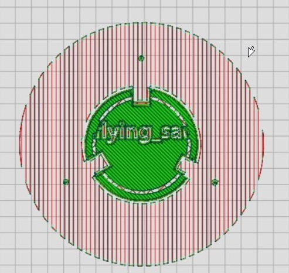
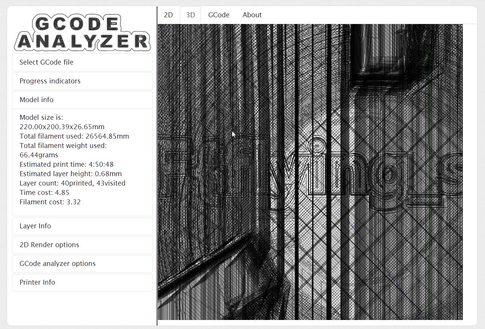

# Unidentifi3ed Flying Object

## Challenge type 

Stego - 100 pts

This challenge is a 2-part challenge with first flag worth 30 pts and the other 70pts.

## Challenge Description

We've seen an Unidentifi3d Flying Object passing by. It was created on one of the universe's most advanced printers.

flag 1 - The UFO was forged on one of the universe's most advanced printers - do you know which make and model? Enter the answer as `Make Model`.

flag 2 - Do you know how GCode files work? Maybe you can find a hidden message along the layers. Flag format: CTF{answer}

## Write up

The first flag is rather simple if you work with 3D printers a lot IRL, scrolling the document to the bottom, we can see the make and model of the 3D printers which is also the flag 

```
geeetech A10M
```
The second flag is not as simple but putting the code through an online Gcode intepreter. we are able to make out some letterings when we scroll through each later



we can make the letterings more visible by removing some of the layers of the model by deleting the code associated to each layer as stated in the comments in the file. 



Analysing the modified Gcode, we can roughly make out the flag to be

```
CTF{flying_saucer}
```
## Flags

1. `geeetech A10M` - 30pts
2. `CTF{flying_saucer}` - 70pts