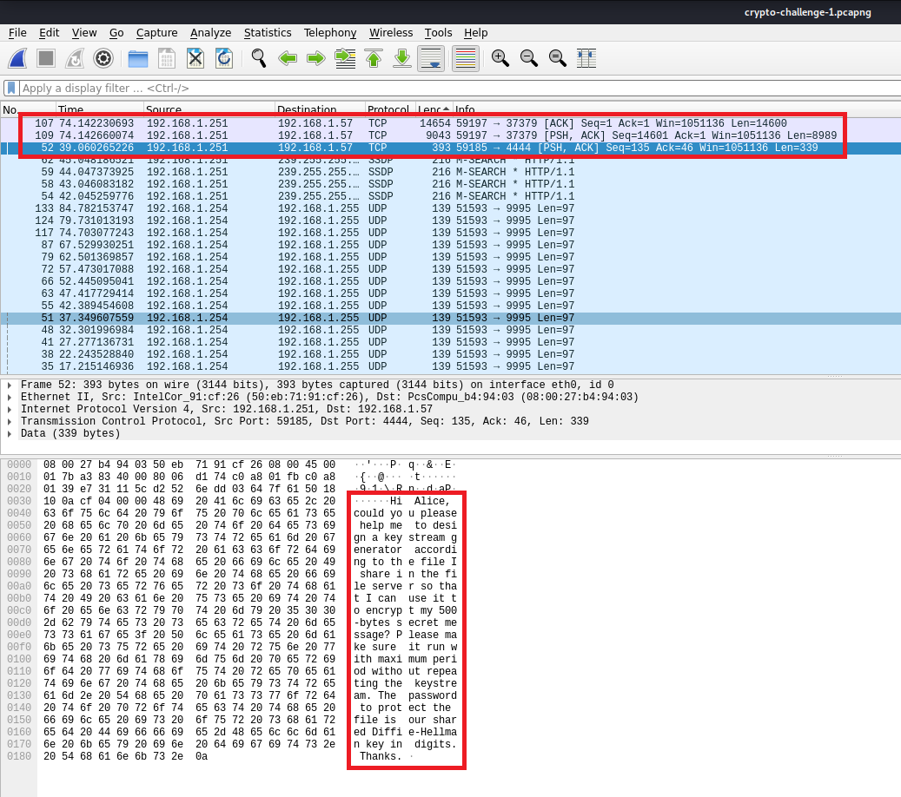
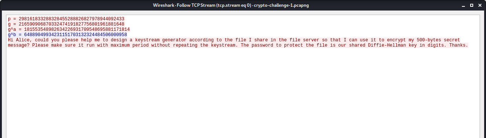

# Can COViD steal Bob's idea?

## Challenge type

Cryptography - 1000pts

## Challenge description

Bob wants Alice to help him design the stream cipher's keystream generator base on his rough idea. Can COViD steal Bob's "protected" idea?

## Writeup

For this challenge you were given only a [packet capture file](./Challenge%20files/). This gives a good indication that a message between Bob and Alice has been intercepted and the contents of this message could contain clues about the flag.

Also looking at the format of the flag given - `govtech-csg{numeric-String}` - It is a good indicator that the flag is purely numbers.

With these information in mind, lets open up [Wireshark](https://www.wireshark.org/) and analyze the packet capture file.

### Step 1

Sorting the network packets by length we notice 3 TCP packets that seems out of the norm in terms of length. Looking at packet no. 52, we can see a message in plain text addressing Alice.

Right click on the packet and click on follow > TCP Stream and you would see the following text pop up

### Step 2

After reading the message you get another hint : **Diffie-Hellman**

This is referring to the [Diffie-Hellman](https://en.wikipedia.org/wiki/Diffie%E2%80%93Hellman_key_exchange) key exchange method. looking at the above image again, the public base (g), public prime (p), Alice's public key (g^a) and Bob's public key (g^b) is given to us. However to know the shared key between Alice and Bob we would need to figure out their secret Key, which is ... well secret (duh!). Let's look at the message again for further clues!

Look at _p_, what do you think of it? _p_ is only 128 bits long !! based on the [Logjam attack](<https://en.wikipedia.org/wiki/Logjam_(computer_security)>), the key exchange algorithm with a public prime that is lower than 512 bits is easy to crack by solving the Discrete Logarithm between the public base, public key and the prime itself, this will result in the obtaining the private key of either sender or receiver depending on who we choose.

### Step 3

We use the [Discrete logarithm calculator](https://www.alpertron.com.ar/DILOG.HTM) to calculate the private keys of Bob and Alice, this would result in

    Alice's private key, a =  509793208876899184549867638120644839163
    Bob's private key, b =  462790561701400501839537914513170124551

### Step 4 

with the private keys of Alice and Bob we can calculate the shared key between them and this would result in

    s = 246544130863363089867058587807471986686

Is this the flag? typing in `govtech-csg{246544130863363089867058587807471986686}` into the submit box confirms that we have found the flag. YAY !!!