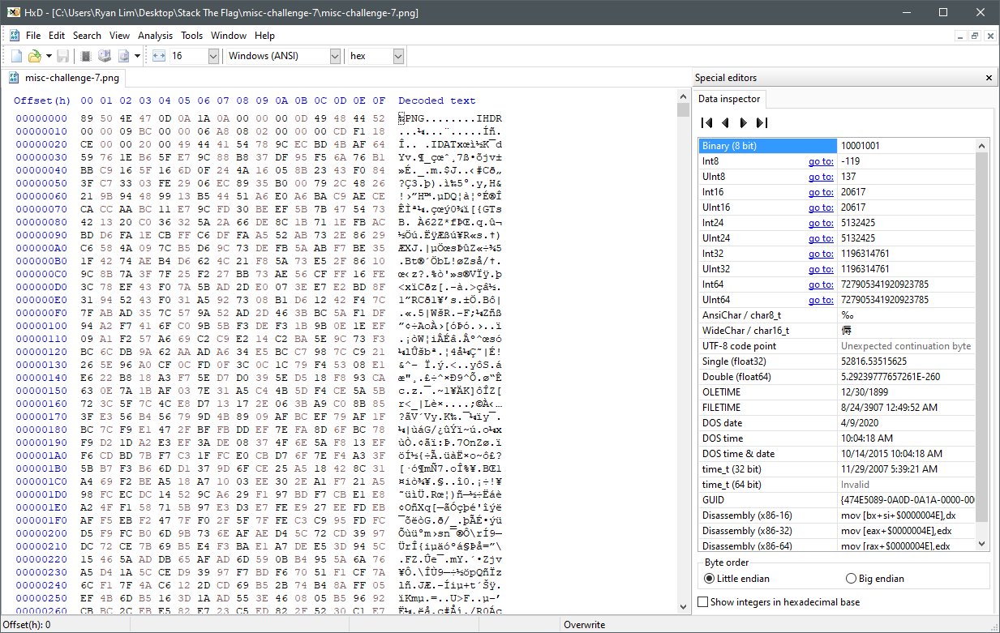
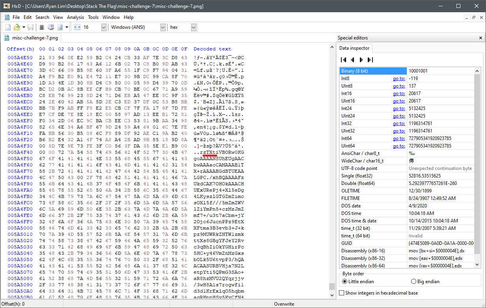
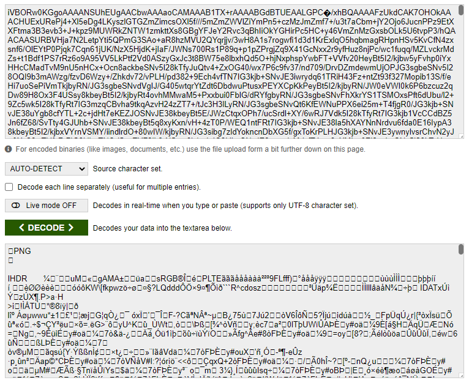
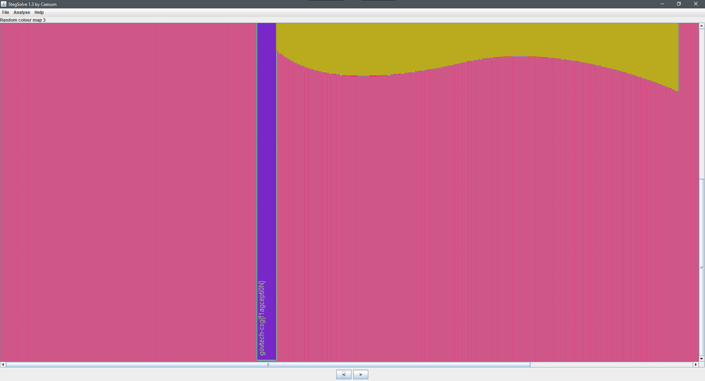

# Where is the flag?

## Challenge type

Miscellaneous - 2000pts

## Challenge description

There's plenty of space to hide flags in our spacious office. Let's see if you can find it!

## Writeup

For this challenge you are given the following PNG image.

This is obviously a challenge that involves steganography so lets open up our steganography tools like Stegsolve.

### Step 1

Using [Stegsolve](https://en.kali.tools/all/?tool=1762) cycle through the filters for the above image.

you would quickly realise that the flag cannot be found. It can't be that simple anyway.

### Step 2

Lets take a look at the hexdump of the image.

scrolling the document all the way to the bottom
we notice that the decoded text becomes ASCII format characters.

notice the string zTXt, that is a tag indicating that the proceeding PNG chunk contains textual data. Taking a glance at the text, it seems to be base-64 encoded

### Step 3

lets copy the string of ASCII Characters and put it through an base-64 decoder tool.

Ah ha! we see that the decoded text contains a PNG header, this indicates that there was an encoded PNG file within the original PNG. Lets put this base-64 encoded string into an online base-64 to PNG converter and we will get the image below

### Step 4

Now putting this image into Stegsolve and iterating through the different filters, we will see a string of text on the flag pole of the flag as shown.

Hence the flag is `govtech-csg{f1agcepti0N}`
