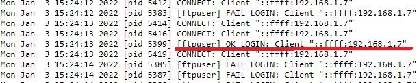

# Compromised FTP

## Challenge type

### Forensics - 25pts

## Challenge Description

We detected some malicious activity on our FTP server. Someone has performed bruteforce attack to gain access
to our FTP server. Find out the Compromised FTP account username & the attacker IP from the following.

Flag Format: KCTF{username_127.0.0.1}

## Write up

Accessing the log files it seems like a standard FTP access log format, we can simply search for an 'OK' 
message to determine the compromised account username as well as the IP address of the attacker.

And the flag is `KCTF{ftpuser_192.168.1.7}`