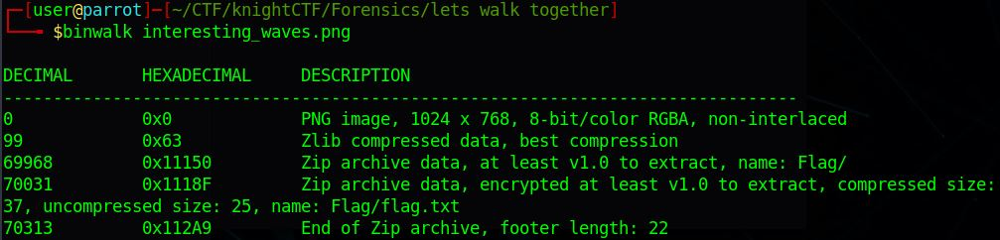
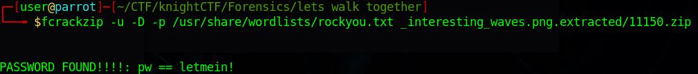

# Let's Walk Together

## Challenge type

### Forensics - 50pts

## Challenge Description

Do you know anything about this image?

Flag Format: KCTF{S0m3_Tex7_H3re}

## Write up

We were given the following image.

Doing a revserse image search as well as a hint from the title of the challenge we can deduce that the challenge involves us using Binwalk tool in
this challenge. by doing Binwalk to analyse the file we get some leads shown below.

From the output we can observe that there is a zip file titled as flag hidden within the image. we can use the `-e` option in binwalk to extract the
zip file. Attempting to open the zip file, we realised that it is password protected, hence we used `fcrackzip` to crack the password of the zip
file which we found to be `letmein!`.

Opening the zip file with the passwords will then reveal `flag.txt` and the flag is found.

The flag is `KCTF{BiNw4lk_is_h3lpfUl}`