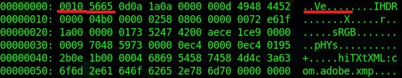
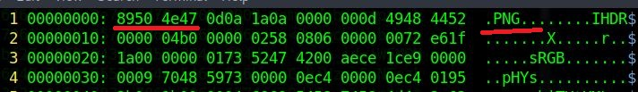

# Unknown File

## Challenge type

### Forensics - 50pts

## Challenge Description

My friend sent me a file & told me there is a flag in it. He dare me to find the flag. But I have no idea what the file is about. Can you help me get the flag?

Flag Format: KCTF{pla1n_t3xt_here}

## Write up

We are given a file off an unknown type, observing the hex dump of the file we can see that the file headers 
bear some resemblence to that of a PNG file header hence we can deduce that the file header could be corrupted.

We can modify the hexdump using vim to correct the headers as shown.

Save the file and open it as a png file and we get the following image with the flag on it.

And the flag is `KCTF{Imag3_H3ad3r_M4nipul4t10N}`
