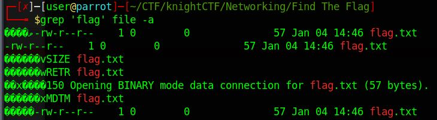

# Find the Flag

## Challenge type

### Networking - 25pts

## Challenge Description

Find the flag from the following file.

## Writeup

We do the `strings` command to look out for any readable text in the file. Quick glance of the file we can deduce that we are looking at an FTP packet stream.
Doing `grep 'flag' file -a` will give us the following output.

Further investigating the file we can find the following base64 encoded text.

     S0NURntGVFBfUDRDSzNUX0M0cFR1cjNfVXNJbmdfV2lyZVNINFJLfQo= 

decoding it will give us the flag `KCTF{FTP_P4CK3T_C4pTur3_UsIng_WireSH4RK}`