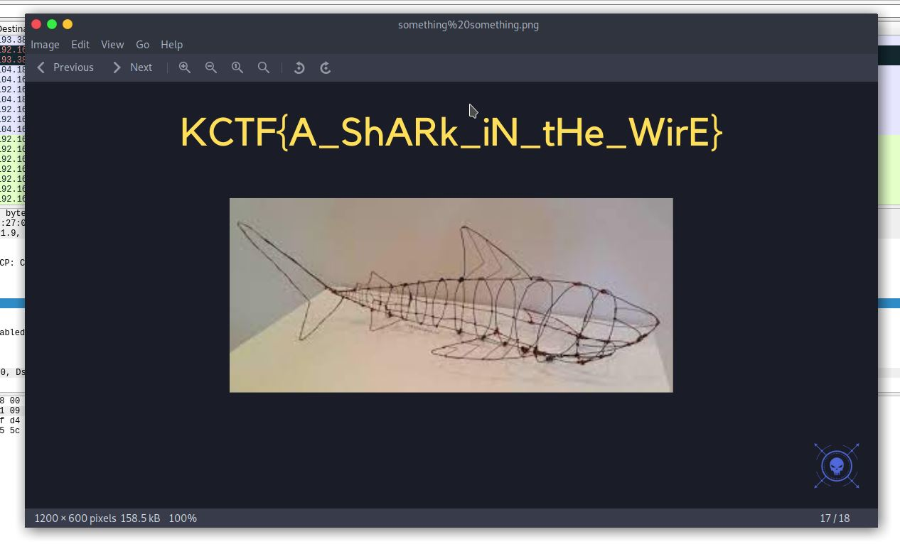

# How's the Shark

## Challenge type

### Networking - 25pts

## Challenge Description

Find the flag from the following file.

## Writeup

We are given a .pcapng file to analyse with wireshark. following the TCP stream we notice that there are several files that are being fetched
from a webserver due to the amount of HTTP packets in the network capture. We can export all the files found into a folder and we notice 
that there is a picture with the flag as shown below.

And the flag is `KCTF{A_ShARk_iN_tHe_WirE}`