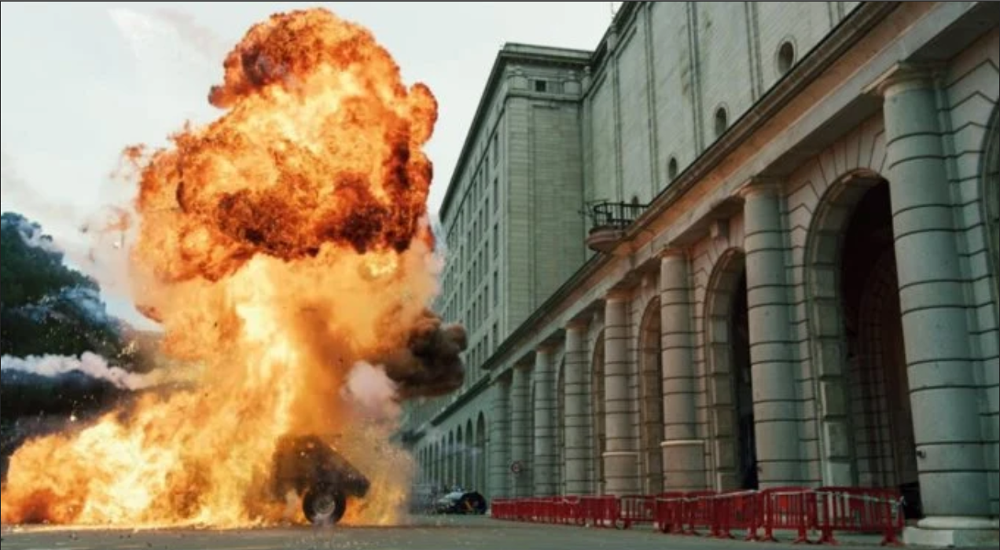

# Explosion In Front of Bank of Spain

## Challenge type

### OSint - 100pts

## Challenge Description

One of my friend sent me the picture and told me that, there was an explotion in front of the Bank of Spain by some robbers a few days ago. After hearing that, I googled about incident. But I discovered that, The picture he gave is not the picture of Bank Of Spain. So, now I want to know the exact location of the picture so that I can know about the incident of that explotion. Can you please help me to find that place? Please send me the coordinates of that location if you can figure it out.

Flag Format: KCTF{xx.xxxxxxx,-x.xxxxxxx}

## Write up

We were given the folloing image.

.

Doing a quick reverse image search on google reveals that this image is a scene from money heist, and from this website ( <https://www.klook.com/en-SG/blog/money-heist-film-locations/> )
we can find the exact same image in section no. 5 and this reveals to us that this is the Ministerio de Fomento. And doing another google
search we can find out that the coordinates are 40.443558, -3.693415.

And the flag is `KCTF{40.4437954,-3.6934058}`