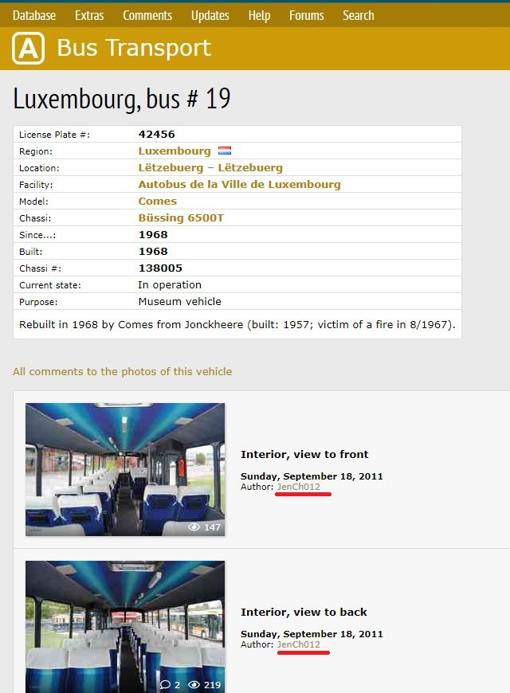
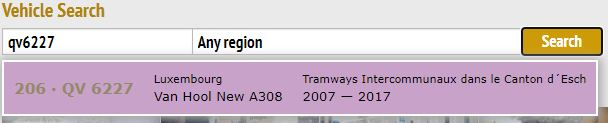
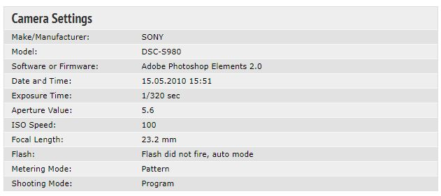

# Find The Camera

## Challenge type

### OSint - 100pts

## Challenge Description

Can you find the manufacturer and the model number of the camera that took the picture of this bus?

Note: The whole flag is in Upper Case letters and replace any special character or space with underscores.

Flag Format: KCTF{MANUFACTURER_MODEL_SINGLELETTERNUMBER}

## Write up

We were given the following image and our goal is to figure out what camera did the photographer used to capture this photo.

Observe the bottom left corner of the picture we can see a copyright symbol and presumably the pseudonym of the photographer.
Doing a quick google search of the author will point us to this website which seems like a photo archive of various public.
buses across the globe.

Exploring the site a little we find a search bar that can search any vehicle accross the globe by vehicle number. We can enter the.
vehicle number (QV6227) into the search bar and we get 1 search result.

Clicking on the search result will bring us to the page where we can find the exact same image in the webpage.

Clicking on the image will take us to another webpage where we can find information about the camera that was used to take this.
picture. The model of the camera is a Sony DSC-S980.

And the flag is `KCTF{SONY_DSC_S980}`.
