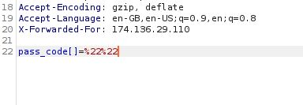

# Find The Camera

## Challenge type

### OSint - 100pts

## Challenge Description

Challenge Link : http://find-pass-code-one.kshackzone.com/

Flag Format : KCTF{something_here}

## Write up

Observing the source code of the landing page we can observe the following comment.

Pasing the source param into the url (<http://find-pass-code-one.kshackzone.com/?source>) we get a snippet of the passcode validation php script shown.

We notice that `strcmp` is used to compare the user input with the actual passcode which returns `NULL` when it is compared to an
empty array, furthermore `NULL == 0` will evaluate to `TRUE`, hence using burpsuite we can modify the packet as shown below.

Then the flag is revealed to us on the web page as shown.

The flag is  `KCTF{ShOuLd_We_UsE_sTrCmP_lIkE_tHaT}`